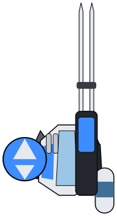
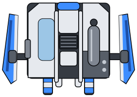
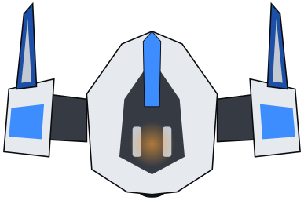
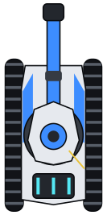
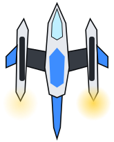
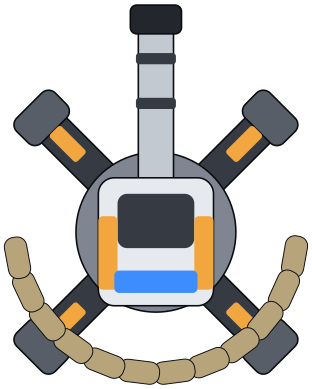
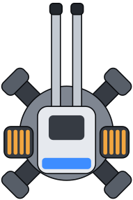
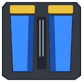

# Models

The player's sprites as SVG files: each unit and building it draws, seen from
straight above in its rest pose. Every file here is written by
[`scripts/player/export-models.mjs`](../scripts/player/export-models.mjs) from
[`crates/player/web/sprites.js`](../crates/player/web/sprites.js), and none is
edited by hand. The sprites are the source: a shape that looks wrong is
changed there, and the script writes the files again.

```bash
node scripts/player/export-models.mjs
```

The docs workflow runs it with `--check`, which fails when a file differs from
what the sprites draw, so a sprite and its file cannot drift apart.

A file is `<sprite>.svg`, in the first team's blue; the page draws the other
team the same, red where these are blue. Lengths are metres with the front up
the page, rendered at 16 pixels to the metre, so the files are to scale with
one another. The sprites are drawn after the game's models, assembled and
posed as [`scripts/player/model-views.py`](../scripts/player/model-views.py)
renders them, but they are drawings of their own: no geometry or texture of
the game is in them.

| Sprite | Name | |
| --- | --- | --- |
| `marksman` | Marksman · 长弓 |  |
| `arclight` | Arclight · 弧光 |  |
| `rhino` | Rhino · 犀牛 |  |
| `crawler` | Crawler · 爬虫 |  |
| `sledgehammer` | Sledgehammer · 铁锤 |  |
| `wasp` | Wasp · 兵蜂 |  |
| `energy_tower` | Energy Tower · 能量塔 |  |
| `research_center` | Research Center · 研究中心 |  |
| `anti_armor_turret` | Anti-Armor Turret · 反装甲炮 |  |
| `rapid_fire_turret` | Rapid-Fire Turret · 速射炮 |  |
| `defensive_wall` | Defensive Wall · 防御墙, one block |  |
